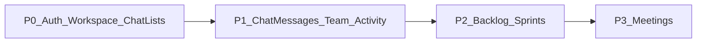

# Backend roadmap: remaining TaskFlow features

This is the **implementation order** for features that are still “Coming soon” (or chat messaging) on the frontend. Use it with the existing contracts below.

## Existing contracts (implement / finish first)

| Doc | Status on FE | Backend priority |
|-----|--------------|------------------|
| [backend-onboarding.md](./backend-onboarding.md) | Live wizard | **P0** — required for signup |
| [backend-workspace.md](./backend-workspace.md) | Live shell | **P0** — workspace + roles + projects |
| [backend-multi-workspace.md](./backend-multi-workspace.md) | Switcher live (no create) | **P0** — `GET /workspaces`, `POST /workspaces/{id}/switch` |
| [backend-chat.md](./backend-chat.md) | Messages wired | **P0/P1** channels + DMs + messages |
| [backend-chat-realtime-notifications.md](./backend-chat-realtime-notifications.md) | Live + toast/Chrome | **P0** STOMP publish + optional `CHAT_MESSAGE` notifs |
| [backend-chat-latency-notifications.md](./backend-chat-latency-notifications.md) | &lt;200ms delivery + off-page alerts | **P0** sync publish + user-queue fan-out |
| [invitations-endpoints.md](./invitations-endpoints.md) | Live | Align with workspace invites in workspace doc |
| [backend-endpoints.md](./backend-endpoints.md) | Legacy reference | Prefer workspace-scoped rules above |

**Security rule for everything below:** resolve workspace from the auth token / membership. Never trust a client-only `workspaceId` for authorization. Cross-workspace ID access → `403` or `404`.

---

## Recommended delivery phases



| Phase | Features | FE unlock |
|-------|----------|-----------|
| **P0** | Onboarding, workspace current, **multi-workspace list/switch**, projects, chat | Switcher + Team + chat |
| **P1** | Team polish; Activity feed API | `/user/activity` |
| **P2** | Backlog + Sprints | Enable `/user/backlog`, `/user/sprints`; dashboard sprint count |
| **P3** | Meetings | Enable `/user/meetings` |

---

## P1 — Chat messages (complete [backend-chat.md](./backend-chat.md))

Shell already calls:

- `GET /workspaces/current/chat/channels`
- `POST /workspaces/current/chat/channels`
- `GET /workspaces/current/chat/dms`

**Still needed for “real” chat:**

| Method | Path | Notes |
|--------|------|--------|
| `GET` | `/workspaces/current/chat/channels/:channelId/messages` | Cursor/`before` + `limit` |
| `POST` | `/workspaces/current/chat/channels/:channelId/messages` | `{ body: string }` |
| `GET` | `/workspaces/current/chat/dms/:threadId/messages` | Same pagination |
| `POST` | `/workspaces/current/chat/dms/:threadId/messages` | `{ body: string }` |
| `POST` | `/workspaces/current/chat/dms` | `{ peerUserId }` start/get thread |

Realtime (reuse `/ws` + STOMP like notifications):

- Subscribe: `/topic/workspaces.{workspaceId}.channels.{channelId}`
- User queue: `/user/queue/chat`

FE follow-up after BE ships: enable composer, message list, optional STOMP client on chat page.

---

## P1 — Team (`/user/team`)

Dedicated workspace members page (today members are only per-project).

### Model

Reuse `workspace_members`:

```
workspace_id, user_id, role (OWNER|ADMIN|MEMBER|GUEST), joined_at, status?
```

### Endpoints

| Method | Path | Who |
|--------|------|-----|
| `GET` | `/workspaces/current/members` | All members |
| `PATCH` | `/workspaces/current/members/:userId` | OWNER/ADMIN — `{ role }` |
| `DELETE` | `/workspaces/current/members/:userId` | OWNER/ADMIN — remove member |
| `POST` | `/workspaces/current/invites` | OWNER/ADMIN — `{ email, role? }` (post-onboarding invites) |

**Response member DTO:**

```json
{
  "userId": 8,
  "fullName": "Jane Doe",
  "email": "jane@example.com",
  "role": "MEMBER",
  "initials": "JD",
  "avatarUrl": null,
  "joinedAt": "2026-03-01T12:00:00.000Z"
}
```

Query: optional `?search=`.

Distinct from **project** invites (`POST /projects/:id/invitations`).

FE follow-up: **done** — Team nav → `/user/team` (list, role change, invite by email).

Also implement [backend-multi-workspace.md](./backend-multi-workspace.md) so users can **switch** workspaces when testing chat across memberships (no in-app create).

---

## P1 — Activity (`/user/activity`)

Dashboard already derives a small feed from notifications. Activity page needs a **workspace audit / activity stream**.

### Endpoints

| Method | Path | Notes |
|--------|------|--------|
| `GET` | `/workspaces/current/activity` | `?limit=20&offset=0` or cursor |

**Item DTO:**

```json
{
  "id": 1,
  "type": "TASK_COMPLETED",
  "actorName": "John",
  "actorUserId": 3,
  "message": "John completed TF-121",
  "entityType": "TASK",
  "entityId": 121,
  "projectId": 2,
  "createdAt": "2026-03-01T12:00:00.000Z"
}
```

Suggested `type` values: `TASK_CREATED`, `TASK_COMPLETED`, `TASK_ASSIGNED`, `PROJECT_CREATED`, `MEMBER_JOINED`, `COMMENT_ADDED`, `SPRINT_STARTED`, `GENERAL`.

Can be backed by notifications table filtered to workspace, or a dedicated `workspace_activities` table.

FE follow-up: Activity nav → `/user/activity` (infinite scroll / pagination).

---

## P2 — Backlog (`/user/backlog`)

Product meaning: **workspace (or project-filtered) ordered list of unscheduled / non-sprint issues**.

### Model options (pick one and stick to it)

**Recommended:** tasks with `sprintId: null` and status not `DONE`, ordered by `backlogRank`.

```
tasks
  … existing fields …
  backlog_rank  int nullable
  sprint_id     nullable FK
```

### Endpoints

| Method | Path | Notes |
|--------|------|--------|
| `GET` | `/workspaces/current/backlog` | `?projectId=` optional |
| `PATCH` | `/workspaces/current/backlog/reorder` | `{ orderedTaskIds: number[] }` |
| `POST` | `/workspaces/current/backlog/:taskId/move-to-sprint` | `{ sprintId }` (after sprints exist) |

**List item:** reuse `TaskDTO` + `backlogRank`.

FE follow-up: Backlog page with drag reorder; filter by project.

---

## P2 — Sprints (`/user/sprints`)

### Model

```
sprints
  id, workspace_id, project_id nullable,
  name, goal,
  status: PLANNED | ACTIVE | COMPLETED,
  start_date, end_date,
  created_at
```

Tasks link via `sprint_id`.

### Endpoints

| Method | Path | Notes |
|--------|------|--------|
| `GET` | `/workspaces/current/sprints` | `?status=ACTIVE` |
| `POST` | `/workspaces/current/sprints` | Create (OWNER/ADMIN/MEMBER) |
| `PATCH` | `/workspaces/current/sprints/:id` | Update / complete |
| `GET` | `/workspaces/current/sprints/:id/tasks` | Tasks in sprint |
| `POST` | `/workspaces/current/sprints/:id/tasks` | `{ taskId }` add to sprint |

Dashboard already shows **Active Sprints** (hardcoded `0` until this exists). Prefer:

```
GET /workspaces/current/dashboard
→ stats.activeSprints
```

(see workspace doc aggregate endpoint).

FE follow-up: Sprints list + detail board; wire dashboard stat.

---

## P3 — Meetings (`/user/meetings`)

### Model (MVP)

```
meetings
  id, workspace_id, project_id nullable,
  title, description,
  starts_at, ends_at,
  meeting_url nullable,
  created_by,
  status: SCHEDULED | LIVE | ENDED | CANCELLED
meeting_participants
  meeting_id, user_id, role: HOST | ATTENDEE
```

### Endpoints

| Method | Path | Notes |
|--------|------|--------|
| `GET` | `/workspaces/current/meetings` | `?from=&to=` |
| `POST` | `/workspaces/current/meetings` | Create + participant ids |
| `PATCH` | `/workspaces/current/meetings/:id` | Update / cancel |
| `GET` | `/workspaces/current/meetings/:id` | Detail |

Realtime join/video is out of scope for API contract V1 — store `meeting_url` (Zoom/Meet link) first.

FE follow-up: Meetings calendar/list; create modal.

---

## Shared response envelope

Same as other docs:

```json
{ "message": "string", "data": {} }
```

Errors: `400`/`422` validation, `401` auth, `403` permission, `404` missing, `429` rate limit.

---

## FE enablement checklist (after each BE slice)

When backend ships a slice, frontend should:

1. **Chat messages** — enable composer + message fetch on `/user/chat`; optional STOMP  
2. **Team** — set Sidebar Team `href: "/user/team"`, remove `comingSoon`  
3. **Activity** — `href: "/user/activity"`  
4. **Backlog** — `href: "/user/backlog"`  
5. **Sprints** — `href: "/user/sprints"` + dashboard `activeSprints`  
6. **Meetings** — `href: "/user/meetings"`  

Sidebar file: `src/app/user/components/Sidebar.tsx`.

---

## Suggested BE test matrix (per feature)

- [ ] Membership required for all `/workspaces/current/*` routes  
- [ ] GUEST cannot mutate (create channel, invite, sprint, meeting) where matrix forbids  
- [ ] Cross-workspace resource IDs rejected  
- [ ] Empty lists return `[]`, not errors  
- [ ] Pagination stable for activity / messages / backlog  

---

## Out of scope (for now)

- Multi-workspace switcher (V3)  
- Built-in WebRTC video  
- Full Jira-parity backlog (epics, story points) — keep rank + sprint link minimal  
- Replacing notifications with activity (keep both; activity is workspace timeline)

Update this file when a phase ships so FE/BE stay aligned.
